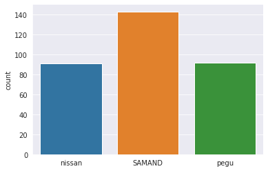
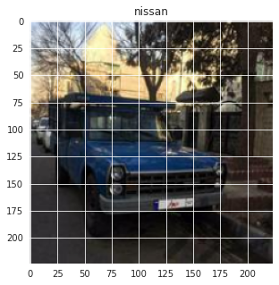
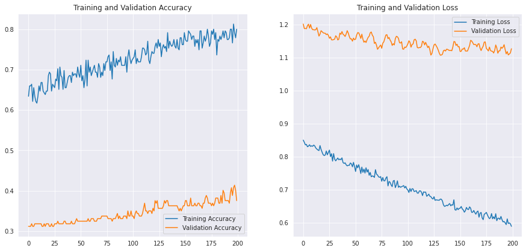
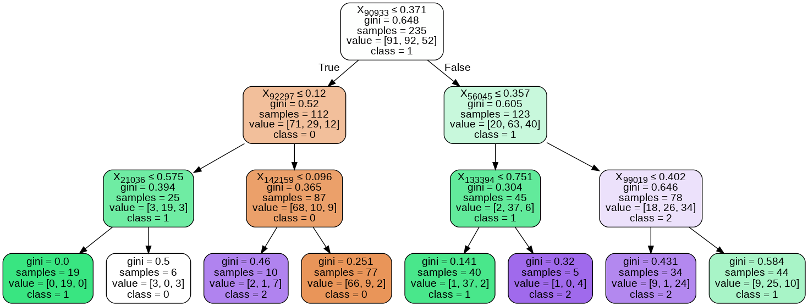

```python
import matplotlib.pyplot as plt
import seaborn as sns

import keras
from keras.models import Sequential
from keras.layers import Dense, Conv2D , MaxPool2D , Flatten , Dropout 
from keras.preprocessing.image import ImageDataGenerator
from keras.optimizers import Adam

from sklearn.metrics import classification_report,confusion_matrix

import tensorflow as tf

import cv2
import os

import numpy as np
```


```python
labels = ['nissan', 'pegu','samand','pride','toyota']
img_size = 224
def get_data(data_dir):
    data = [] 
    for label in labels: 
        path = os.path.join(data_dir, label)
        class_num = labels.index(label)
        for img in os.listdir(path):
            try:
                img_arr = cv2.imread(os.path.join(path, img))[...,::-1] #convert BGR to RGB format
                resized_arr = cv2.resize(img_arr, (img_size, img_size)) # Reshaping images to preferred size
                data.append([resized_arr, class_num])
            except Exception as e:
                print(e)
    return np.array(data)
```


```python
#Now we can easily fetch our train and validation data.
train = get_data('/content/CarDivar-/train')
val = get_data('/content/CarDivar-/test')
```

    'NoneType' object is not subscriptable
    'NoneType' object is not subscriptable
    'NoneType' object is not subscriptable
    'NoneType' object is not subscriptable
    

    /usr/local/lib/python3.6/dist-packages/ipykernel_launcher.py:15: VisibleDeprecationWarning: Creating an ndarray from ragged nested sequences (which is a list-or-tuple of lists-or-tuples-or ndarrays with different lengths or shapes) is deprecated. If you meant to do this, you must specify 'dtype=object' when creating the ndarray
      from ipykernel import kernelapp as app
    


```python
l = []
for i in train:
    if(i[1] == 0):
        l.append("nissan")
    if(i[1] == 1):
        l.append("pegu")
    if(i[1] == 2):
        l.append("samand")
    if(i[1] == 3):
        l.append("pride")
    else:
        l.append("toyota")
sns.set_style('darkgrid')
sns.countplot(l)
```

    /usr/local/lib/python3.6/dist-packages/seaborn/_decorators.py:43: FutureWarning: Pass the following variable as a keyword arg: x. From version 0.12, the only valid positional argument will be `data`, and passing other arguments without an explicit keyword will result in an error or misinterpretation.
      FutureWarning
    


    <matplotlib.axes._subplots.AxesSubplot at 0x7fe7e9070c50>





```python
plt.figure(figsize = (5,5))
plt.imshow(train[1][0])
plt.title(labels[train[0][1]])
```


    Text(0.5, 1.0, 'nissan')





```python
x_train = []
y_train = []
x_val = []
y_val = []

for feature, label in train:
  x_train.append(feature)
  y_train.append(label)

for feature, label in val:
  x_val.append(feature)
  y_val.append(label)

# Normalize the data
x_train = np.array(x_train) / 255
x_val = np.array(x_val) / 255

x_train.reshape(-1, img_size, img_size, 1)
y_train = np.array(y_train)

x_val.reshape(-1, img_size, img_size, 1)
y_val = np.array(y_val)
```


```python
model = Sequential()
model.add(Conv2D(32,3,padding="same", activation="relu", input_shape=(224,224,3)))
model.add(MaxPool2D())

model.add(Conv2D(32, 3, padding="same", activation="relu"))
model.add(MaxPool2D())

model.add(Conv2D(64, 3, padding="same", activation="relu"))
model.add(MaxPool2D())
model.add(Dropout(0.4))

model.add(Flatten())
model.add(Dense(128,activation="relu"))
model.add(Dense(5, activation="softmax"))


model.summary()
```

    Model: "sequential_3"
    _________________________________________________________________
    Layer (type)                 Output Shape              Param #   
    =================================================================
    conv2d_9 (Conv2D)            (None, 224, 224, 32)      896       
    _________________________________________________________________
    max_pooling2d_9 (MaxPooling2 (None, 112, 112, 32)      0         
    _________________________________________________________________
    conv2d_10 (Conv2D)           (None, 112, 112, 32)      9248      
    _________________________________________________________________
    max_pooling2d_10 (MaxPooling (None, 56, 56, 32)        0         
    _________________________________________________________________
    conv2d_11 (Conv2D)           (None, 56, 56, 64)        18496     
    _________________________________________________________________
    max_pooling2d_11 (MaxPooling (None, 28, 28, 64)        0         
    _________________________________________________________________
    dropout_3 (Dropout)          (None, 28, 28, 64)        0         
    _________________________________________________________________
    flatten_3 (Flatten)          (None, 50176)             0         
    _________________________________________________________________
    dense_6 (Dense)              (None, 128)               6422656   
    _________________________________________________________________
    dense_7 (Dense)              (None, 3)                 387       
    =================================================================
    Total params: 6,451,683
    Trainable params: 6,451,683
    Non-trainable params: 0
    _________________________________________________________________
    


```python
opt = Adam(lr=0.000001)
model.compile(optimizer = opt , loss = tf.keras.losses.SparseCategoricalCrossentropy(from_logits=True) , metrics = ['accuracy'])
```


```python
history = model.fit(x_train,y_train,epochs = 200 , validation_data = (x_val, y_val))
```

    Epoch 1/200
    8/8 [==============================] - 0s 60ms/step - loss: 0.8506 - accuracy: 0.6340 - val_loss: 1.2023 - val_accuracy: 0.3121
    Epoch 2/200
    8/8 [==============================] - 0s 46ms/step - loss: 0.8438 - accuracy: 0.6596 - val_loss: 1.1885 - val_accuracy: 0.3121
    Epoch 3/200
    8/8 [==============================] - 0s 47ms/step - loss: 0.8362 - accuracy: 0.6596 - val_loss: 1.1890 - val_accuracy: 0.3121
    Epoch 4/200
    8/8 [==============================] - 0s 46ms/step - loss: 0.8376 - accuracy: 0.6638 - val_loss: 1.1881 - val_accuracy: 0.3185
    Epoch 5/200
    8/8 [==============================] - 0s 47ms/step - loss: 0.8304 - accuracy: 0.6213 - val_loss: 1.1973 - val_accuracy: 0.3121
    Epoch 6/200
    8/8 [==============================] - 0s 47ms/step - loss: 0.8324 - accuracy: 0.6553 - val_loss: 1.2019 - val_accuracy: 0.3121
    Epoch 7/200
    8/8 [==============================] - 0s 47ms/step - loss: 0.8365 - accuracy: 0.6340 - val_loss: 1.1900 - val_accuracy: 0.3185
    Epoch 8/200
    8/8 [==============================] - 0s 47ms/step - loss: 0.8315 - accuracy: 0.6213 - val_loss: 1.2009 - val_accuracy: 0.3185
    Epoch 9/200
    8/8 [==============================] - 0s 48ms/step - loss: 0.8332 - accuracy: 0.6170 - val_loss: 1.1899 - val_accuracy: 0.3185
    Epoch 10/200
    8/8 [==============================] - 0s 65ms/step - loss: 0.8318 - accuracy: 0.6340 - val_loss: 1.1852 - val_accuracy: 0.3185
    Epoch 11/200
    8/8 [==============================] - 0s 47ms/step - loss: 0.8356 - accuracy: 0.6596 - val_loss: 1.1852 - val_accuracy: 0.3185
    Epoch 12/200
    8/8 [==============================] - 0s 46ms/step - loss: 0.8327 - accuracy: 0.6468 - val_loss: 1.1842 - val_accuracy: 0.3185
    Epoch 13/200
    8/8 [==============================] - 0s 46ms/step - loss: 0.8265 - accuracy: 0.6681 - val_loss: 1.1854 - val_accuracy: 0.3185
    Epoch 14/200
    8/8 [==============================] - 0s 47ms/step - loss: 0.8233 - accuracy: 0.6681 - val_loss: 1.1915 - val_accuracy: 0.3121
    Epoch 15/200
    8/8 [==============================] - 0s 48ms/step - loss: 0.8206 - accuracy: 0.6468 - val_loss: 1.1785 - val_accuracy: 0.3121
    Epoch 16/200
    8/8 [==============================] - 0s 47ms/step - loss: 0.8188 - accuracy: 0.6426 - val_loss: 1.1658 - val_accuracy: 0.3185
    Epoch 17/200
    8/8 [==============================] - 0s 46ms/step - loss: 0.8340 - accuracy: 0.6383 - val_loss: 1.1717 - val_accuracy: 0.3121
    Epoch 18/200
    8/8 [==============================] - 0s 48ms/step - loss: 0.8224 - accuracy: 0.6468 - val_loss: 1.1821 - val_accuracy: 0.3185
    Epoch 19/200
    8/8 [==============================] - 0s 47ms/step - loss: 0.8139 - accuracy: 0.6468 - val_loss: 1.1793 - val_accuracy: 0.3185
    Epoch 20/200
    8/8 [==============================] - 0s 47ms/step - loss: 0.8064 - accuracy: 0.6851 - val_loss: 1.1759 - val_accuracy: 0.3185
    Epoch 21/200
    8/8 [==============================] - 0s 48ms/step - loss: 0.8038 - accuracy: 0.6936 - val_loss: 1.1745 - val_accuracy: 0.3121
    Epoch 22/200
    8/8 [==============================] - 0s 47ms/step - loss: 0.8054 - accuracy: 0.6894 - val_loss: 1.1745 - val_accuracy: 0.3121
    Epoch 23/200
    8/8 [==============================] - 0s 49ms/step - loss: 0.8176 - accuracy: 0.6468 - val_loss: 1.1701 - val_accuracy: 0.3185
    Epoch 24/200
    8/8 [==============================] - 0s 47ms/step - loss: 0.8060 - accuracy: 0.6638 - val_loss: 1.1723 - val_accuracy: 0.3121
    Epoch 25/200
    8/8 [==============================] - 0s 48ms/step - loss: 0.8129 - accuracy: 0.6596 - val_loss: 1.1681 - val_accuracy: 0.3121
    Epoch 26/200
    8/8 [==============================] - 0s 47ms/step - loss: 0.8203 - accuracy: 0.6553 - val_loss: 1.1591 - val_accuracy: 0.3185
    Epoch 27/200
    8/8 [==============================] - 0s 46ms/step - loss: 0.8005 - accuracy: 0.6766 - val_loss: 1.1635 - val_accuracy: 0.3185
    Epoch 28/200
    8/8 [==============================] - 0s 46ms/step - loss: 0.8093 - accuracy: 0.6723 - val_loss: 1.1545 - val_accuracy: 0.3185
    Epoch 29/200
    8/8 [==============================] - 0s 48ms/step - loss: 0.7869 - accuracy: 0.7021 - val_loss: 1.1541 - val_accuracy: 0.3248
    Epoch 30/200
    8/8 [==============================] - 0s 47ms/step - loss: 0.8097 - accuracy: 0.6511 - val_loss: 1.1552 - val_accuracy: 0.3185
    Epoch 31/200
    8/8 [==============================] - 0s 48ms/step - loss: 0.7929 - accuracy: 0.7064 - val_loss: 1.1566 - val_accuracy: 0.3185
    Epoch 32/200
    8/8 [==============================] - 0s 48ms/step - loss: 0.7876 - accuracy: 0.6851 - val_loss: 1.1667 - val_accuracy: 0.3185
    Epoch 33/200
    8/8 [==============================] - 0s 48ms/step - loss: 0.7919 - accuracy: 0.6809 - val_loss: 1.1633 - val_accuracy: 0.3185
    Epoch 34/200
    8/8 [==============================] - 0s 48ms/step - loss: 0.7963 - accuracy: 0.6511 - val_loss: 1.1540 - val_accuracy: 0.3185
    Epoch 35/200
    8/8 [==============================] - 0s 48ms/step - loss: 0.7909 - accuracy: 0.6979 - val_loss: 1.1565 - val_accuracy: 0.3248
    Epoch 36/200
    8/8 [==============================] - 0s 47ms/step - loss: 0.7932 - accuracy: 0.6553 - val_loss: 1.1748 - val_accuracy: 0.3248
    Epoch 37/200
    8/8 [==============================] - 0s 48ms/step - loss: 0.7910 - accuracy: 0.6553 - val_loss: 1.1710 - val_accuracy: 0.3185
    Epoch 38/200
    8/8 [==============================] - 0s 47ms/step - loss: 0.7968 - accuracy: 0.6681 - val_loss: 1.1795 - val_accuracy: 0.3185
    Epoch 39/200
    8/8 [==============================] - 0s 48ms/step - loss: 0.7826 - accuracy: 0.6809 - val_loss: 1.1714 - val_accuracy: 0.3185
    Epoch 40/200
    8/8 [==============================] - 0s 48ms/step - loss: 0.7799 - accuracy: 0.6851 - val_loss: 1.1688 - val_accuracy: 0.3185
    Epoch 41/200
    8/8 [==============================] - 0s 49ms/step - loss: 0.7817 - accuracy: 0.6851 - val_loss: 1.1646 - val_accuracy: 0.3185
    Epoch 42/200
    8/8 [==============================] - 0s 48ms/step - loss: 0.7757 - accuracy: 0.6681 - val_loss: 1.1722 - val_accuracy: 0.3248
    Epoch 43/200
    8/8 [==============================] - 0s 47ms/step - loss: 0.7725 - accuracy: 0.6936 - val_loss: 1.1822 - val_accuracy: 0.3185
    Epoch 44/200
    8/8 [==============================] - 0s 46ms/step - loss: 0.7743 - accuracy: 0.6851 - val_loss: 1.1751 - val_accuracy: 0.3185
    Epoch 45/200
    8/8 [==============================] - 0s 49ms/step - loss: 0.7739 - accuracy: 0.6894 - val_loss: 1.1648 - val_accuracy: 0.3185
    Epoch 46/200
    8/8 [==============================] - 0s 48ms/step - loss: 0.7813 - accuracy: 0.6894 - val_loss: 1.1572 - val_accuracy: 0.3248
    Epoch 47/200
    8/8 [==============================] - 0s 48ms/step - loss: 0.7787 - accuracy: 0.6809 - val_loss: 1.1576 - val_accuracy: 0.3312
    Epoch 48/200
    8/8 [==============================] - 0s 47ms/step - loss: 0.7696 - accuracy: 0.7064 - val_loss: 1.1503 - val_accuracy: 0.3248
    Epoch 49/200
    8/8 [==============================] - 0s 48ms/step - loss: 0.7832 - accuracy: 0.6894 - val_loss: 1.1596 - val_accuracy: 0.3248
    Epoch 50/200
    8/8 [==============================] - 0s 47ms/step - loss: 0.7704 - accuracy: 0.6809 - val_loss: 1.1549 - val_accuracy: 0.3248
    Epoch 51/200
    8/8 [==============================] - 0s 47ms/step - loss: 0.7555 - accuracy: 0.7106 - val_loss: 1.1564 - val_accuracy: 0.3248
    Epoch 52/200
    8/8 [==============================] - 0s 48ms/step - loss: 0.7751 - accuracy: 0.6723 - val_loss: 1.1688 - val_accuracy: 0.3248
    Epoch 53/200
    8/8 [==============================] - 0s 48ms/step - loss: 0.7667 - accuracy: 0.6851 - val_loss: 1.1762 - val_accuracy: 0.3248
    Epoch 54/200
    8/8 [==============================] - 0s 64ms/step - loss: 0.7760 - accuracy: 0.6553 - val_loss: 1.1757 - val_accuracy: 0.3248
    Epoch 55/200
    8/8 [==============================] - 0s 48ms/step - loss: 0.7651 - accuracy: 0.6766 - val_loss: 1.1684 - val_accuracy: 0.3248
    Epoch 56/200
    8/8 [==============================] - 0s 47ms/step - loss: 0.7494 - accuracy: 0.7234 - val_loss: 1.1586 - val_accuracy: 0.3248
    Epoch 57/200
    8/8 [==============================] - 0s 48ms/step - loss: 0.7687 - accuracy: 0.6596 - val_loss: 1.1716 - val_accuracy: 0.3248
    Epoch 58/200
    8/8 [==============================] - 0s 49ms/step - loss: 0.7528 - accuracy: 0.7234 - val_loss: 1.1565 - val_accuracy: 0.3312
    Epoch 59/200
    8/8 [==============================] - 0s 47ms/step - loss: 0.7627 - accuracy: 0.6936 - val_loss: 1.1471 - val_accuracy: 0.3248
    Epoch 60/200
    8/8 [==============================] - 0s 48ms/step - loss: 0.7507 - accuracy: 0.7064 - val_loss: 1.1509 - val_accuracy: 0.3248
    Epoch 61/200
    8/8 [==============================] - 0s 48ms/step - loss: 0.7667 - accuracy: 0.6851 - val_loss: 1.1463 - val_accuracy: 0.3312
    Epoch 62/200
    8/8 [==============================] - 0s 48ms/step - loss: 0.7536 - accuracy: 0.6936 - val_loss: 1.1549 - val_accuracy: 0.3312
    Epoch 63/200
    8/8 [==============================] - 0s 48ms/step - loss: 0.7614 - accuracy: 0.7021 - val_loss: 1.1619 - val_accuracy: 0.3312
    Epoch 64/200
    8/8 [==============================] - 0s 48ms/step - loss: 0.7438 - accuracy: 0.7106 - val_loss: 1.1654 - val_accuracy: 0.3248
    Epoch 65/200
    8/8 [==============================] - 0s 47ms/step - loss: 0.7525 - accuracy: 0.6936 - val_loss: 1.1757 - val_accuracy: 0.3248
    Epoch 66/200
    8/8 [==============================] - 0s 49ms/step - loss: 0.7394 - accuracy: 0.6936 - val_loss: 1.1783 - val_accuracy: 0.3248
    Epoch 67/200
    8/8 [==============================] - 0s 48ms/step - loss: 0.7420 - accuracy: 0.6809 - val_loss: 1.1687 - val_accuracy: 0.3312
    Epoch 68/200
    8/8 [==============================] - 0s 48ms/step - loss: 0.7409 - accuracy: 0.7149 - val_loss: 1.1640 - val_accuracy: 0.3312
    Epoch 69/200
    8/8 [==============================] - 0s 48ms/step - loss: 0.7375 - accuracy: 0.7064 - val_loss: 1.1435 - val_accuracy: 0.3312
    Epoch 70/200
    8/8 [==============================] - 0s 47ms/step - loss: 0.7609 - accuracy: 0.6809 - val_loss: 1.1471 - val_accuracy: 0.3312
    Epoch 71/200
    8/8 [==============================] - 0s 49ms/step - loss: 0.7476 - accuracy: 0.6936 - val_loss: 1.1381 - val_accuracy: 0.3376
    Epoch 72/200
    8/8 [==============================] - 0s 48ms/step - loss: 0.7447 - accuracy: 0.6851 - val_loss: 1.1258 - val_accuracy: 0.3376
    Epoch 73/200
    8/8 [==============================] - 0s 47ms/step - loss: 0.7393 - accuracy: 0.7149 - val_loss: 1.1304 - val_accuracy: 0.3376
    Epoch 74/200
    8/8 [==============================] - 0s 47ms/step - loss: 0.7376 - accuracy: 0.6979 - val_loss: 1.1347 - val_accuracy: 0.3376
    Epoch 75/200
    8/8 [==============================] - 0s 48ms/step - loss: 0.7400 - accuracy: 0.7191 - val_loss: 1.1387 - val_accuracy: 0.3376
    Epoch 76/200
    8/8 [==============================] - 0s 47ms/step - loss: 0.7258 - accuracy: 0.7191 - val_loss: 1.1289 - val_accuracy: 0.3376
    Epoch 77/200
    8/8 [==============================] - 0s 48ms/step - loss: 0.7372 - accuracy: 0.7319 - val_loss: 1.1442 - val_accuracy: 0.3312
    Epoch 78/200
    8/8 [==============================] - 0s 48ms/step - loss: 0.7272 - accuracy: 0.7362 - val_loss: 1.1484 - val_accuracy: 0.3312
    Epoch 79/200
    8/8 [==============================] - 0s 49ms/step - loss: 0.7271 - accuracy: 0.6979 - val_loss: 1.1587 - val_accuracy: 0.3312
    Epoch 80/200
    8/8 [==============================] - 0s 50ms/step - loss: 0.7354 - accuracy: 0.7191 - val_loss: 1.1691 - val_accuracy: 0.3312
    Epoch 81/200
    8/8 [==============================] - 0s 48ms/step - loss: 0.7397 - accuracy: 0.6766 - val_loss: 1.1699 - val_accuracy: 0.3248
    Epoch 82/200
    8/8 [==============================] - 0s 49ms/step - loss: 0.7117 - accuracy: 0.7447 - val_loss: 1.1580 - val_accuracy: 0.3312
    Epoch 83/200
    8/8 [==============================] - 0s 47ms/step - loss: 0.7252 - accuracy: 0.7106 - val_loss: 1.1618 - val_accuracy: 0.3312
    Epoch 84/200
    8/8 [==============================] - 0s 49ms/step - loss: 0.7228 - accuracy: 0.7064 - val_loss: 1.1537 - val_accuracy: 0.3312
    Epoch 85/200
    8/8 [==============================] - 0s 47ms/step - loss: 0.7146 - accuracy: 0.7277 - val_loss: 1.1487 - val_accuracy: 0.3376
    Epoch 86/200
    8/8 [==============================] - 0s 48ms/step - loss: 0.7096 - accuracy: 0.7106 - val_loss: 1.1375 - val_accuracy: 0.3439
    Epoch 87/200
    8/8 [==============================] - 0s 48ms/step - loss: 0.7268 - accuracy: 0.7234 - val_loss: 1.1428 - val_accuracy: 0.3312
    Epoch 88/200
    8/8 [==============================] - 0s 48ms/step - loss: 0.7283 - accuracy: 0.7191 - val_loss: 1.1390 - val_accuracy: 0.3376
    Epoch 89/200
    8/8 [==============================] - 0s 63ms/step - loss: 0.7065 - accuracy: 0.7319 - val_loss: 1.1579 - val_accuracy: 0.3312
    Epoch 90/200
    8/8 [==============================] - 0s 50ms/step - loss: 0.7146 - accuracy: 0.7106 - val_loss: 1.1652 - val_accuracy: 0.3312
    Epoch 91/200
    8/8 [==============================] - 0s 48ms/step - loss: 0.7271 - accuracy: 0.7106 - val_loss: 1.1637 - val_accuracy: 0.3312
    Epoch 92/200
    8/8 [==============================] - 0s 47ms/step - loss: 0.7075 - accuracy: 0.7106 - val_loss: 1.1588 - val_accuracy: 0.3376
    Epoch 93/200
    8/8 [==============================] - 0s 49ms/step - loss: 0.7108 - accuracy: 0.7106 - val_loss: 1.1457 - val_accuracy: 0.3376
    Epoch 94/200
    8/8 [==============================] - 0s 48ms/step - loss: 0.7075 - accuracy: 0.7319 - val_loss: 1.1447 - val_accuracy: 0.3376
    Epoch 95/200
    8/8 [==============================] - 0s 48ms/step - loss: 0.7094 - accuracy: 0.6936 - val_loss: 1.1486 - val_accuracy: 0.3312
    Epoch 96/200
    8/8 [==============================] - 0s 48ms/step - loss: 0.7108 - accuracy: 0.7319 - val_loss: 1.1267 - val_accuracy: 0.3503
    Epoch 97/200
    8/8 [==============================] - 0s 47ms/step - loss: 0.7128 - accuracy: 0.7489 - val_loss: 1.1259 - val_accuracy: 0.3376
    Epoch 98/200
    8/8 [==============================] - 0s 48ms/step - loss: 0.7055 - accuracy: 0.7277 - val_loss: 1.1326 - val_accuracy: 0.3376
    Epoch 99/200
    8/8 [==============================] - 0s 49ms/step - loss: 0.7104 - accuracy: 0.7149 - val_loss: 1.1311 - val_accuracy: 0.3503
    Epoch 100/200
    8/8 [==============================] - 0s 48ms/step - loss: 0.7025 - accuracy: 0.7234 - val_loss: 1.1356 - val_accuracy: 0.3376
    Epoch 101/200
    8/8 [==============================] - 0s 47ms/step - loss: 0.6993 - accuracy: 0.7277 - val_loss: 1.1424 - val_accuracy: 0.3376
    Epoch 102/200
    8/8 [==============================] - 0s 48ms/step - loss: 0.6918 - accuracy: 0.7319 - val_loss: 1.1516 - val_accuracy: 0.3312
    Epoch 103/200
    8/8 [==============================] - 0s 49ms/step - loss: 0.7039 - accuracy: 0.7489 - val_loss: 1.1470 - val_accuracy: 0.3439
    Epoch 104/200
    8/8 [==============================] - 0s 50ms/step - loss: 0.6947 - accuracy: 0.7149 - val_loss: 1.1322 - val_accuracy: 0.3503
    Epoch 105/200
    8/8 [==============================] - 0s 49ms/step - loss: 0.7032 - accuracy: 0.7277 - val_loss: 1.1403 - val_accuracy: 0.3439
    Epoch 106/200
    8/8 [==============================] - 0s 49ms/step - loss: 0.7026 - accuracy: 0.7191 - val_loss: 1.1420 - val_accuracy: 0.3439
    Epoch 107/200
    8/8 [==============================] - 0s 49ms/step - loss: 0.6947 - accuracy: 0.7191 - val_loss: 1.1546 - val_accuracy: 0.3376
    Epoch 108/200
    8/8 [==============================] - 0s 48ms/step - loss: 0.6958 - accuracy: 0.7191 - val_loss: 1.1564 - val_accuracy: 0.3376
    Epoch 109/200
    8/8 [==============================] - 0s 49ms/step - loss: 0.6975 - accuracy: 0.7319 - val_loss: 1.1513 - val_accuracy: 0.3376
    Epoch 110/200
    8/8 [==============================] - 0s 49ms/step - loss: 0.6900 - accuracy: 0.7532 - val_loss: 1.1312 - val_accuracy: 0.3439
    Epoch 111/200
    8/8 [==============================] - 0s 47ms/step - loss: 0.6898 - accuracy: 0.7532 - val_loss: 1.1299 - val_accuracy: 0.3567
    Epoch 112/200
    8/8 [==============================] - 0s 48ms/step - loss: 0.6966 - accuracy: 0.7489 - val_loss: 1.1312 - val_accuracy: 0.3694
    Epoch 113/200
    8/8 [==============================] - 0s 48ms/step - loss: 0.6969 - accuracy: 0.7362 - val_loss: 1.1309 - val_accuracy: 0.3503
    Epoch 114/200
    8/8 [==============================] - 0s 50ms/step - loss: 0.6927 - accuracy: 0.7404 - val_loss: 1.1352 - val_accuracy: 0.3503
    Epoch 115/200
    8/8 [==============================] - 0s 49ms/step - loss: 0.6824 - accuracy: 0.7702 - val_loss: 1.1501 - val_accuracy: 0.3439
    Epoch 116/200
    8/8 [==============================] - 0s 49ms/step - loss: 0.6936 - accuracy: 0.7234 - val_loss: 1.1482 - val_accuracy: 0.3503
    Epoch 117/200
    8/8 [==============================] - 0s 49ms/step - loss: 0.6925 - accuracy: 0.7149 - val_loss: 1.1391 - val_accuracy: 0.3503
    Epoch 118/200
    8/8 [==============================] - 0s 64ms/step - loss: 0.6930 - accuracy: 0.7319 - val_loss: 1.1468 - val_accuracy: 0.3503
    Epoch 119/200
    8/8 [==============================] - 0s 47ms/step - loss: 0.6802 - accuracy: 0.7447 - val_loss: 1.1392 - val_accuracy: 0.3439
    Epoch 120/200
    8/8 [==============================] - 0s 49ms/step - loss: 0.6829 - accuracy: 0.7404 - val_loss: 1.1310 - val_accuracy: 0.3567
    Epoch 121/200
    8/8 [==============================] - 0s 49ms/step - loss: 0.6868 - accuracy: 0.7404 - val_loss: 1.1352 - val_accuracy: 0.3503
    Epoch 122/200
    8/8 [==============================] - 0s 50ms/step - loss: 0.6803 - accuracy: 0.7574 - val_loss: 1.1247 - val_accuracy: 0.3758
    Epoch 123/200
    8/8 [==============================] - 0s 48ms/step - loss: 0.6791 - accuracy: 0.7660 - val_loss: 1.1082 - val_accuracy: 0.3694
    Epoch 124/200
    8/8 [==============================] - 0s 48ms/step - loss: 0.6742 - accuracy: 0.7532 - val_loss: 1.1131 - val_accuracy: 0.3758
    Epoch 125/200
    8/8 [==============================] - 0s 49ms/step - loss: 0.6720 - accuracy: 0.7745 - val_loss: 1.1272 - val_accuracy: 0.3567
    Epoch 126/200
    8/8 [==============================] - 0s 49ms/step - loss: 0.6789 - accuracy: 0.7574 - val_loss: 1.1389 - val_accuracy: 0.3567
    Epoch 127/200
    8/8 [==============================] - 0s 49ms/step - loss: 0.6680 - accuracy: 0.7660 - val_loss: 1.1418 - val_accuracy: 0.3567
    Epoch 128/200
    8/8 [==============================] - 0s 48ms/step - loss: 0.6696 - accuracy: 0.7319 - val_loss: 1.1368 - val_accuracy: 0.3567
    Epoch 129/200
    8/8 [==============================] - 0s 48ms/step - loss: 0.6689 - accuracy: 0.7532 - val_loss: 1.1311 - val_accuracy: 0.3567
    Epoch 130/200
    8/8 [==============================] - 0s 49ms/step - loss: 0.6685 - accuracy: 0.7617 - val_loss: 1.1236 - val_accuracy: 0.3631
    Epoch 131/200
    8/8 [==============================] - 0s 47ms/step - loss: 0.6683 - accuracy: 0.7532 - val_loss: 1.1144 - val_accuracy: 0.3758
    Epoch 132/200
    8/8 [==============================] - 0s 48ms/step - loss: 0.6718 - accuracy: 0.7574 - val_loss: 1.1080 - val_accuracy: 0.3694
    Epoch 133/200
    8/8 [==============================] - 0s 48ms/step - loss: 0.6714 - accuracy: 0.7447 - val_loss: 1.1084 - val_accuracy: 0.3758
    Epoch 134/200
    8/8 [==============================] - 0s 48ms/step - loss: 0.6664 - accuracy: 0.7915 - val_loss: 1.1105 - val_accuracy: 0.3758
    Epoch 135/200
    8/8 [==============================] - 0s 49ms/step - loss: 0.6544 - accuracy: 0.7532 - val_loss: 1.1211 - val_accuracy: 0.3631
    Epoch 136/200
    8/8 [==============================] - 0s 47ms/step - loss: 0.6497 - accuracy: 0.7702 - val_loss: 1.1233 - val_accuracy: 0.3631
    Epoch 137/200
    8/8 [==============================] - 0s 48ms/step - loss: 0.6509 - accuracy: 0.7617 - val_loss: 1.1205 - val_accuracy: 0.3631
    Epoch 138/200
    8/8 [==============================] - 0s 49ms/step - loss: 0.6532 - accuracy: 0.7574 - val_loss: 1.1261 - val_accuracy: 0.3631
    Epoch 139/200
    8/8 [==============================] - 0s 49ms/step - loss: 0.6515 - accuracy: 0.7617 - val_loss: 1.1254 - val_accuracy: 0.3631
    Epoch 140/200
    8/8 [==============================] - 0s 49ms/step - loss: 0.6556 - accuracy: 0.7745 - val_loss: 1.1232 - val_accuracy: 0.3631
    Epoch 141/200
    8/8 [==============================] - 0s 49ms/step - loss: 0.6581 - accuracy: 0.7574 - val_loss: 1.1222 - val_accuracy: 0.3631
    Epoch 142/200
    8/8 [==============================] - 0s 49ms/step - loss: 0.6513 - accuracy: 0.7532 - val_loss: 1.1225 - val_accuracy: 0.3631
    Epoch 143/200
    8/8 [==============================] - 0s 49ms/step - loss: 0.6548 - accuracy: 0.7745 - val_loss: 1.1213 - val_accuracy: 0.3631
    Epoch 144/200
    8/8 [==============================] - 0s 50ms/step - loss: 0.6533 - accuracy: 0.7532 - val_loss: 1.1327 - val_accuracy: 0.3567
    Epoch 145/200
    8/8 [==============================] - 0s 49ms/step - loss: 0.6696 - accuracy: 0.7489 - val_loss: 1.1494 - val_accuracy: 0.3503
    Epoch 146/200
    8/8 [==============================] - 0s 49ms/step - loss: 0.6396 - accuracy: 0.7787 - val_loss: 1.1485 - val_accuracy: 0.3567
    Epoch 147/200
    8/8 [==============================] - 0s 49ms/step - loss: 0.6381 - accuracy: 0.7787 - val_loss: 1.1375 - val_accuracy: 0.3503
    Epoch 148/200
    8/8 [==============================] - 0s 50ms/step - loss: 0.6450 - accuracy: 0.7617 - val_loss: 1.1413 - val_accuracy: 0.3567
    Epoch 149/200
    8/8 [==============================] - 0s 49ms/step - loss: 0.6398 - accuracy: 0.7617 - val_loss: 1.1335 - val_accuracy: 0.3631
    Epoch 150/200
    8/8 [==============================] - 0s 48ms/step - loss: 0.6437 - accuracy: 0.7915 - val_loss: 1.1338 - val_accuracy: 0.3631
    Epoch 151/200
    8/8 [==============================] - 0s 48ms/step - loss: 0.6440 - accuracy: 0.7745 - val_loss: 1.1190 - val_accuracy: 0.3758
    Epoch 152/200
    8/8 [==============================] - 0s 47ms/step - loss: 0.6494 - accuracy: 0.7702 - val_loss: 1.1199 - val_accuracy: 0.3758
    Epoch 153/200
    8/8 [==============================] - 0s 49ms/step - loss: 0.6420 - accuracy: 0.7702 - val_loss: 1.1268 - val_accuracy: 0.3631
    Epoch 154/200
    8/8 [==============================] - 0s 48ms/step - loss: 0.6389 - accuracy: 0.7957 - val_loss: 1.1262 - val_accuracy: 0.3631
    Epoch 155/200
    8/8 [==============================] - 0s 48ms/step - loss: 0.6321 - accuracy: 0.7915 - val_loss: 1.1305 - val_accuracy: 0.3631
    Epoch 156/200
    8/8 [==============================] - 0s 48ms/step - loss: 0.6368 - accuracy: 0.7872 - val_loss: 1.1206 - val_accuracy: 0.3822
    Epoch 157/200
    8/8 [==============================] - 0s 48ms/step - loss: 0.6465 - accuracy: 0.7745 - val_loss: 1.1204 - val_accuracy: 0.3631
    Epoch 158/200
    8/8 [==============================] - 0s 47ms/step - loss: 0.6412 - accuracy: 0.7830 - val_loss: 1.1205 - val_accuracy: 0.3631
    Epoch 159/200
    8/8 [==============================] - 0s 48ms/step - loss: 0.6401 - accuracy: 0.7830 - val_loss: 1.1291 - val_accuracy: 0.3631
    Epoch 160/200
    8/8 [==============================] - 0s 49ms/step - loss: 0.6483 - accuracy: 0.7574 - val_loss: 1.1372 - val_accuracy: 0.3694
    Epoch 161/200
    8/8 [==============================] - 0s 50ms/step - loss: 0.6441 - accuracy: 0.7745 - val_loss: 1.1530 - val_accuracy: 0.3631
    Epoch 162/200
    8/8 [==============================] - 0s 64ms/step - loss: 0.6316 - accuracy: 0.7660 - val_loss: 1.1509 - val_accuracy: 0.3631
    Epoch 163/200
    8/8 [==============================] - 0s 49ms/step - loss: 0.6318 - accuracy: 0.7745 - val_loss: 1.1459 - val_accuracy: 0.3694
    Epoch 164/200
    8/8 [==============================] - 0s 49ms/step - loss: 0.6373 - accuracy: 0.7489 - val_loss: 1.1401 - val_accuracy: 0.3694
    Epoch 165/200
    8/8 [==============================] - 0s 48ms/step - loss: 0.6310 - accuracy: 0.7957 - val_loss: 1.1404 - val_accuracy: 0.3631
    Epoch 166/200
    8/8 [==============================] - 0s 49ms/step - loss: 0.6259 - accuracy: 0.7957 - val_loss: 1.1400 - val_accuracy: 0.3631
    Epoch 167/200
    8/8 [==============================] - 0s 48ms/step - loss: 0.6329 - accuracy: 0.7532 - val_loss: 1.1336 - val_accuracy: 0.3567
    Epoch 168/200
    8/8 [==============================] - 0s 50ms/step - loss: 0.6356 - accuracy: 0.7660 - val_loss: 1.1416 - val_accuracy: 0.3694
    Epoch 169/200
    8/8 [==============================] - 0s 49ms/step - loss: 0.6169 - accuracy: 0.7830 - val_loss: 1.1428 - val_accuracy: 0.3694
    Epoch 170/200
    8/8 [==============================] - 0s 48ms/step - loss: 0.6288 - accuracy: 0.7702 - val_loss: 1.1297 - val_accuracy: 0.3822
    Epoch 171/200
    8/8 [==============================] - 0s 50ms/step - loss: 0.6314 - accuracy: 0.7787 - val_loss: 1.1219 - val_accuracy: 0.3885
    Epoch 172/200
    8/8 [==============================] - 0s 48ms/step - loss: 0.6148 - accuracy: 0.8000 - val_loss: 1.1296 - val_accuracy: 0.3822
    Epoch 173/200
    8/8 [==============================] - 0s 47ms/step - loss: 0.6094 - accuracy: 0.7830 - val_loss: 1.1352 - val_accuracy: 0.3694
    Epoch 174/200
    8/8 [==============================] - 0s 50ms/step - loss: 0.6258 - accuracy: 0.7574 - val_loss: 1.1475 - val_accuracy: 0.3694
    Epoch 175/200
    8/8 [==============================] - 0s 49ms/step - loss: 0.6279 - accuracy: 0.7660 - val_loss: 1.1480 - val_accuracy: 0.3694
    Epoch 176/200
    8/8 [==============================] - 0s 48ms/step - loss: 0.6315 - accuracy: 0.7957 - val_loss: 1.1289 - val_accuracy: 0.3631
    Epoch 177/200
    8/8 [==============================] - 0s 49ms/step - loss: 0.6241 - accuracy: 0.7872 - val_loss: 1.1247 - val_accuracy: 0.3694
    Epoch 178/200
    8/8 [==============================] - 0s 49ms/step - loss: 0.6174 - accuracy: 0.8000 - val_loss: 1.1208 - val_accuracy: 0.3631
    Epoch 179/200
    8/8 [==============================] - 0s 49ms/step - loss: 0.6125 - accuracy: 0.7745 - val_loss: 1.1325 - val_accuracy: 0.3694
    Epoch 180/200
    8/8 [==============================] - 0s 48ms/step - loss: 0.6155 - accuracy: 0.7915 - val_loss: 1.1221 - val_accuracy: 0.3822
    Epoch 181/200
    8/8 [==============================] - 0s 49ms/step - loss: 0.6279 - accuracy: 0.7362 - val_loss: 1.1201 - val_accuracy: 0.3822
    Epoch 182/200
    8/8 [==============================] - 0s 48ms/step - loss: 0.6121 - accuracy: 0.7745 - val_loss: 1.1195 - val_accuracy: 0.3822
    Epoch 183/200
    8/8 [==============================] - 0s 49ms/step - loss: 0.6181 - accuracy: 0.7702 - val_loss: 1.1145 - val_accuracy: 0.3694
    Epoch 184/200
    8/8 [==============================] - 0s 49ms/step - loss: 0.6119 - accuracy: 0.7830 - val_loss: 1.1226 - val_accuracy: 0.3694
    Epoch 185/200
    8/8 [==============================] - 0s 50ms/step - loss: 0.6274 - accuracy: 0.7745 - val_loss: 1.1389 - val_accuracy: 0.3885
    Epoch 186/200
    8/8 [==============================] - 0s 49ms/step - loss: 0.6063 - accuracy: 0.7830 - val_loss: 1.1303 - val_accuracy: 0.3694
    Epoch 187/200
    8/8 [==============================] - 0s 48ms/step - loss: 0.6135 - accuracy: 0.7957 - val_loss: 1.1138 - val_accuracy: 0.4013
    Epoch 188/200
    8/8 [==============================] - 0s 50ms/step - loss: 0.6140 - accuracy: 0.7787 - val_loss: 1.1210 - val_accuracy: 0.3949
    Epoch 189/200
    8/8 [==============================] - 0s 49ms/step - loss: 0.6101 - accuracy: 0.7957 - val_loss: 1.1211 - val_accuracy: 0.3758
    Epoch 190/200
    8/8 [==============================] - 0s 48ms/step - loss: 0.6192 - accuracy: 0.7915 - val_loss: 1.1326 - val_accuracy: 0.3758
    Epoch 191/200
    8/8 [==============================] - 0s 49ms/step - loss: 0.6093 - accuracy: 0.7745 - val_loss: 1.1288 - val_accuracy: 0.3758
    Epoch 192/200
    8/8 [==============================] - 0s 49ms/step - loss: 0.6026 - accuracy: 0.7745 - val_loss: 1.1325 - val_accuracy: 0.3758
    Epoch 193/200
    8/8 [==============================] - 0s 48ms/step - loss: 0.6037 - accuracy: 0.7787 - val_loss: 1.1398 - val_accuracy: 0.3694
    Epoch 194/200
    8/8 [==============================] - 0s 49ms/step - loss: 0.6000 - accuracy: 0.8000 - val_loss: 1.1250 - val_accuracy: 0.3949
    Epoch 195/200
    8/8 [==============================] - 0s 49ms/step - loss: 0.5945 - accuracy: 0.8000 - val_loss: 1.1119 - val_accuracy: 0.4076
    Epoch 196/200
    8/8 [==============================] - 0s 48ms/step - loss: 0.6118 - accuracy: 0.7660 - val_loss: 1.1189 - val_accuracy: 0.3885
    Epoch 197/200
    8/8 [==============================] - 1s 66ms/step - loss: 0.5979 - accuracy: 0.8128 - val_loss: 1.1087 - val_accuracy: 0.4076
    Epoch 198/200
    8/8 [==============================] - 0s 50ms/step - loss: 0.5996 - accuracy: 0.7915 - val_loss: 1.1115 - val_accuracy: 0.4140
    Epoch 199/200
    8/8 [==============================] - 0s 49ms/step - loss: 0.5969 - accuracy: 0.7787 - val_loss: 1.1148 - val_accuracy: 0.4013
    Epoch 200/200
    8/8 [==============================] - 0s 48ms/step - loss: 0.5891 - accuracy: 0.8000 - val_loss: 1.1275 - val_accuracy: 0.3758
    


```python
acc = history.history['accuracy']
val_acc = history.history['val_accuracy']
loss = history.history['loss']
val_loss = history.history['val_loss']

epochs_range = range(200)

plt.figure(figsize=(15, 15))
plt.subplot(2, 2, 1)
plt.plot(epochs_range, acc, label='Training Accuracy')
plt.plot(epochs_range, val_acc, label='Validation Accuracy')
plt.legend(loc='lower right')
plt.title('Training and Validation Accuracy')

plt.subplot(2, 2, 2)
plt.plot(epochs_range, loss, label='Training Loss')
plt.plot(epochs_range, val_loss, label='Validation Loss')
plt.legend(loc='upper right')
plt.title('Training and Validation Loss')
plt.show()
```





```python
predictions = model.predict_classes(x_val)
predictions = predictions.reshape(1,-1)[0]
print(classification_report(y_val, predictions, target_names = ['nissan (Class 0)','pegu (Class 1)','samand (Class 2)','pride (Class 3)','toyota (Class 4)']))
```

                      precision    recall  f1-score   support
    
    nissan (Class 0)       0.24      0.92      0.38        26
      pegu (Class 1)       0.26      0.38      0.31        40
    samand (Class 2)       0.00      0.00      0.00        91
    
            accuracy                           0.25       157
           macro avg       0.17      0.43      0.23       157
        weighted avg       0.11      0.25      0.14       157
    
    

    /usr/local/lib/python3.6/dist-packages/tensorflow/python/keras/engine/sequential.py:450: UserWarning: `model.predict_classes()` is deprecated and will be removed after 2021-01-01. Please use instead:* `np.argmax(model.predict(x), axis=-1)`,   if your model does multi-class classification   (e.g. if it uses a `softmax` last-layer activation).* `(model.predict(x) > 0.5).astype("int32")`,   if your model does binary classification   (e.g. if it uses a `sigmoid` last-layer activation).
      warnings.warn('`model.predict_classes()` is deprecated and '
    /usr/local/lib/python3.6/dist-packages/sklearn/metrics/_classification.py:1272: UndefinedMetricWarning: Precision and F-score are ill-defined and being set to 0.0 in labels with no predicted samples. Use `zero_division` parameter to control this behavior.
      _warn_prf(average, modifier, msg_start, len(result))
    


```python
#developing a model
from sklearn.tree import DecisionTreeClassifier
x_train = x_train.reshape(235,3*224*224)

clf_pruned = DecisionTreeClassifier(criterion = "gini", random_state = 100,
                               max_depth=3, min_samples_leaf=5)

clf_pruned.fit(x_train, y_train)#visualizing the tree


```


    DecisionTreeClassifier(ccp_alpha=0.0, class_weight=None, criterion='gini',
                           max_depth=3, max_features=None, max_leaf_nodes=None,
                           min_impurity_decrease=0.0, min_impurity_split=None,
                           min_samples_leaf=5, min_samples_split=2,
                           min_weight_fraction_leaf=0.0, presort='deprecated',
                           random_state=100, splitter='best')


```python
from sklearn import metrics #Import scikit-learn metrics module for accuracy calculation
x_val = x_val.reshape(157,3*224*224)
y_pred = clf_pruned.predict(x_val)
print("Accuracy:",metrics.accuracy_score(y_val, y_pred))
```

    Accuracy: 0.34394904458598724
    


```python
from sklearn.tree import export_graphviz
from sklearn.externals.six import StringIO  
from IPython.display import Image  
import pydotplus

dot_data = StringIO()
export_graphviz(clf_pruned, out_file=dot_data,  
                filled=True, rounded=True,
                special_characters=True,class_names=['0','1','2','3','4'])
graph = pydotplus.graph_from_dot_data(dot_data.getvalue())  
graph.write_png('diabetes.png')
Image(graph.create_png())
```





